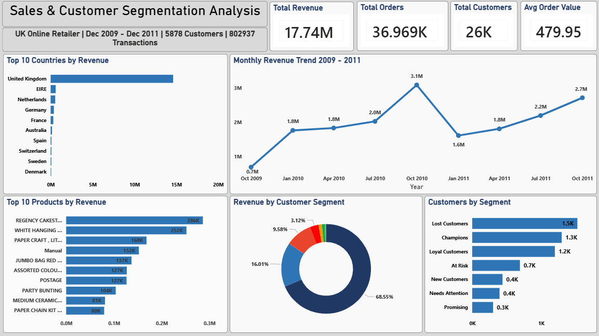

# Retail Sales & Customer Segmentation Analysis

## Project Overview
An end-to-end data analysis project examining 
sales performance and customer behaviour for a 
UK-based online retailer between December 2009 
and December 2011.

The centrepiece of this project is an RFM 
(Recency, Frequency, Monetary) segmentation 
model that categorises 5,878 customers into 
7 actionable segments to drive targeted 
marketing strategy.

---

## Key Findings
- Champions represent only 22% of customers 
  but generate 70% of all revenue — £11.96M 
  out of £17.45M total
- 693 At Risk customers represent £1.67M in 
  revenue at risk of being lost — a retention 
  campaign targeting these could significantly 
  impact revenue
- November is peak revenue month both years — 
  Christmas gifting drives a clear seasonal 
  pattern with revenue nearly doubling from 
  summer lows
- The business is predominantly B2B wholesale — 
  almost zero Saturday transactions and peak 
  activity on Thursday lunchtimes
- EIRE customers average £120K revenue each 
  vs UK customers at £2,750 — clear wholesale 
  vs retail split

---

## RFM Segments

| Segment | Customers | Total Revenue |
|---|---|---|
| Champions | 1,300 | £11,963,950 |
| Loyal Customers | 1,201 | £2,794,226 |
| At Risk | 693 | £1,672,053 |
| Lost Customers | 1,528 | £545,045 |
| Needs Attention | 397 | £214,502 |
| New Customers | 440 | £173,128 |
| Promising | 303 | £89,248 |

---

## Tools Used
- **PostgreSQL** — data storage, cleaning 
  and analysis
- **Power BI** — interactive dashboard

---

## Data Source
UCI Machine Learning Repository — Online 
Retail II Dataset
https://www.kaggle.com/datasets/mashlyn/online-retail-ii-uci

---

## SQL Queries
Six analytical queries were written to answer:
1. Monthly revenue trend over 2 years
2. Top 20 best selling products by revenue
3. Revenue and customer breakdown by country
4. Peak shopping hours and days of week
5. RFM segmentation scoring all 5,878 customers
6. Customer segment summary with key metrics

All queries saved in the `/queries` folder.

---

## Dashboard Preview

---

*Created by [Your Name] | June 2026*
